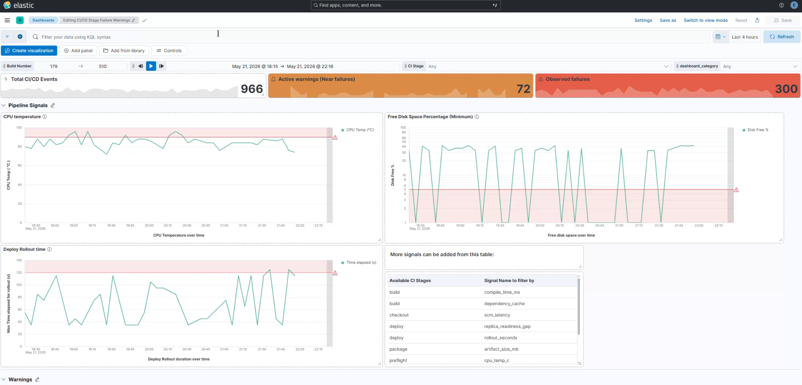

# CI-CD-Observability-Stream

Final project for Technologies for Advanced Programming (TAP).
A way to analyze events incoming from a CI/CD pipeline.



## Description

This project is a small observability pipeline for a Jenkins CI/CD job.

The idea is to simulate a normal build pipeline and follow its events while they move through a real-time data architecture:

- Jenkins produces CI/CD telemetry and build log events
- Logstash sends the raw events to Kafka
- Spark cleans the events and extracts useful fields
- Spark MLlib adds simple stage failure warnings
- Elasticsearch stores the final events
- Kibana shows the dashboard

The project is meant as an academic demo, so the main goal is to show the full path of the data from the pipeline to the dashboard.

---

# Requirements


For running the full stack locally, the requirements are:

- Docker
- Docker Compose V2
- At least 6-8 GB of available RAM (12 GB Recommended)
- A shell able to run Docker commands (Bash recommended to make use of the Makefile)

On Windows, Docker Desktop should be running before starting the stack.

# Installation


Clone the repository, create the local environment file, and start the
containers:

```bash
cp .env.example .env
docker compose up -d --build
```

The first start can take some time because Spark and the other services need to
download their images and dependencies.

# Usage

Start the local demo stack:

```bash
# Windows, Powershell
docker compose up -d --build
```
or
```bash
# bash, WSL
make up
```

Main local entry points:

- Jenkins: http://localhost:8080
- Kafka UI: http://localhost:8085
- Elasticsearch: http://localhost:9200
- Kibana dashboard: http://localhost:5601/app/dashboards#/view/cicd-observability-command-center

Default demo credentials are listed in `.env.example`.

To generate data, open Jenkins, login with the demo user, and run the
`demo-ci-observability` job a few times.

Default local Jenkins login:

```text
admin / admin
```

Some useful commands:

```bash
# Show the Kafka topics
make topics

# Read raw events
make consume

# Read Spark processed events
make consume-processed

# Read ML scored events
make consume-scored

# Print a small Elasticsearch summary
make es-summary
```

All of these commands are basically macros that expand to windows-friendly commands.
See all definitions in the Makefile.

## Technologies and Infrastructure

- **Jenkins**: simulates the CI/CD pipeline used as the source of the data.
- **OpenTelemetry Collector**: receives Jenkins telemetry and writes it as JSON
  lines.
- **Logstash**: reads the telemetry files and Jenkins logs, then sends events to
  Kafka.
- **Kafka**: keeps the streaming topics used between the project components.
- **Spark Structured Streaming**: cleans raw telemetry and creates normalized CI/CD
  events.
- **Spark MLlib**: adds a simple Logistic Regression model for stage failure
  warnings.
- **Elasticsearch**: indexes the final events so they can be queried quickly.
- **Kibana**: shows the final dashboard over the Elasticsearch index.

## Repository Structure

```text
project/
|-- docker-compose.yml          # Local multi-container stack
|-- Makefile                    # Helper commands
|-- docs/                       # Demo documentation per step
|-- jenkins/                    # Jenkins image, plugins, JCasC and demo job
|-- otel-collector/             # OpenTelemetry Collector configuration
|-- logstash/                   # Logstash ingestion pipeline
|-- spark/                      # Spark processing and MLlib scoring code
|-- elastic_indexer/            # Kafka to Elasticsearch indexer
|-- kibana/                     # Exported Kibana dashboard
|-- scripts/                    # Small topic consumer helpers (for debug purposes)
|-- README.md                   # This file!
```
