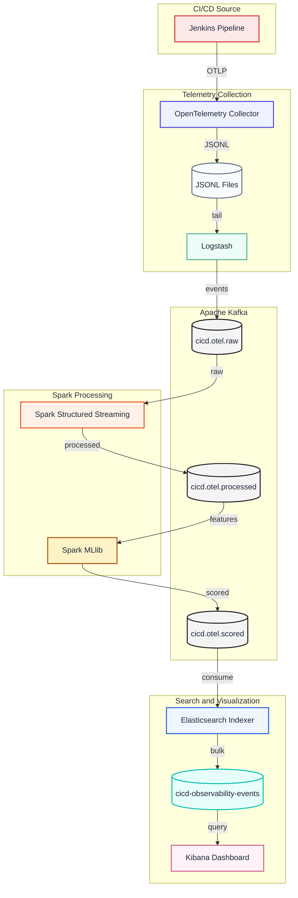

# Pipeline Overview

This project demonstrates a small end-to-end CI/CD observability pipeline.

A **Jenkins demo job** simulates a CI/CD pipeline executing, which then emits telemetry signals from said pipeline. **OpenTelemetry** then collects these traces, metrics, and logs, which are then collected by **Logstash**. **Logstash** turns those signals (plus useful Jenkins build log lines) into structured events.

**Kafka** is the streaming handoff between most stages, with 3 topics:
- raw telemetry enter the `cicd.otel.raw` topic.
- **Spark Structured Streaming** cleans and enriches it into `cicd.otel.processed`
- **Spark MLlib** stage produces scored warning events in `cicd.otel.scored`.

The **Elasticsearch** indexer consumes those scored events, adds indexing metadata such as `@timestamp` and the Kafka source offset, writes them to the `cicd-observability-events` index, and finally we can use **Kibana** to visualize the indexed CI/CD warnings and failures in the final dashboard.
**Kibana** implements a Data view and a dashboard made in its UI, with no further work required by the user.

## Diagram overview

