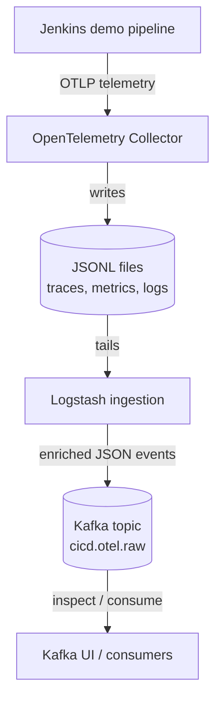

# Pipeline Overview

Diagram in WIP.

## Data Ingestion

```mermaid
flowchart TD
    Jenkins["Jenkins demo pipeline"]
    OTel["OpenTelemetry Collector"]
    Files[("JSONL files\ntraces, metrics, logs")]
    Logstash["Logstash ingestion"]
    Kafka[("Kafka topic\ncicd.otel.raw")]
    KafkaUI["Kafka UI / consumers"]

    Jenkins -->|"OTLP telemetry"| OTel
    OTel -->|"writes"| Files
    Files -->|"tails"| Logstash
    Logstash -->|"enriched JSON events"| Kafka
    Kafka -->|"inspect / consume"| KafkaUI
```
