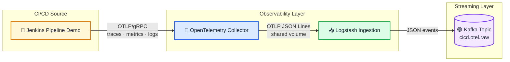

# Data Ingestion (and Streaming) how to:

First part of our pipeline (in detail):



## Pre-requisites

Intended for this part only:

- Docker + Docker Compose;
- At least 6-8 GB of available RAM.
- Git
- Docker (v 4.72.0)
- Docker Compose V2
- A Bash-compatible shell for helper scripts:
  - Linux/macOS terminal
  - WSL2 shell on Windows
- On Windows, ensure that Docker Desktop is running before executing any Docker commands.
  - Also: ensure that `✅ Use the WSL2 Based Engine` setting is turned on.


## Start

```bash
cp .env.example .env
docker compose up -d --build
```

Main services:

- Jenkins: http://localhost:8080
- Kafka UI: http://localhost:8085
- OpenTelemetry Collector OTLP/gRPC: localhost:4317
- OpenTelemetry Collector OTLP/HTTP: localhost:4318

Local Jenkins Credentials:

```text
admin / admin
```

## Demo (manual)

1. Open Jenkins on http://localhost:8080.
2. Login with `admin / admin`.
3. Open the job: `demo-ci-observability`.
4. Execute `Build Now` a few times. Some builds will fail, some will succeed.
5. Then, run the `consume_raw_topics` scripts (.sh for Linux, .ps1 for Windows Powershell).
    5b. Ensuring you have correct permissions...
6. Or simply open Kafka UI on http://localhost:8085.
7. And check the topic `cicd.otel.raw`.

Or, if you prefer, via CLI:

```bash
docker compose exec kafka /opt/kafka/bin/kafka-console-consumer.sh \
  --bootstrap-server localhost:9092 \
  --topic cicd.otel.raw \
  --from-beginning
```
