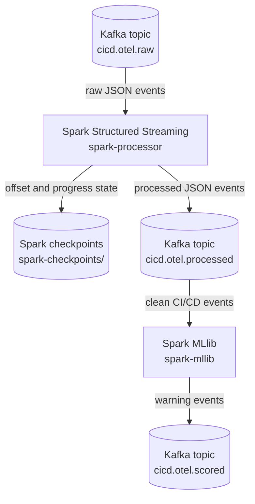

# Processing with Spark Structured Streaming

This step adds the processing stage immediately after Kafka. It reads raw CI/CD telemetry events from `cicd.otel.raw`, keeps only result-level pipeline events, and writes cleaned observability events to `cicd.otel.processed`.

The processed topic is the handoff point for the next stage: the Spark MLlib component consumes `cicd.otel.processed`, predicts stage-failure warnings, and writes the ML result to `cicd.otel.scored`.



## What this stage uses

- Raw input topic: `cicd.otel.raw`
- Processed output topic: `cicd.otel.processed`
- Next consumer: `spark-mllib`
- Next output topic: `cicd.otel.scored`
- Spark checkpoint path: `/tmp/spark-checkpoints/cicd-otel-processed`
- Component name added by Spark: `spark-structured-streaming`

The Spark job only consumes from the raw topic and writes to the processed topic.
It does not touch Jenkins, Logstash state files, or the OpenTelemetry output files.
The MLlib stage then reads the processed topic as its input; this processor does not call MLlib directly.

Both Kafka topics are created by `kafka-init` before Logstash and Spark start using them.
This keeps the startup order predictable and avoids Spark subscribing to a topic that does not exist yet.

## What Spark writes

Each message written to Kafka uses `raw_event_sha256` as the key. Spark uses the
raw payload only while parsing; it does not forward the raw log body to lower
pipeline stages. For a build-stage event, the value is a JSON object like this:

```json
{
  "processing_component": "spark-structured-streaming",
  "processed_at": "2026-05-11T00:00:00.000Z",
  "raw_event_sha256": "sha256-of-the-original-event",
  "observed_at": "2026-05-11T00:00:00.000Z",
  "ci_event": "build",
  "ci_stage": "build",
  "stage_order": 3,
  "ci_status": "success",
  "event_kind": "stage_result",
  "signal_domain": "build",
  "signal_name": "compile_time_ms",
  "signal_value": 4200,
  "signal_unit": "ms",
  "severity_level": "normal",
  "event_summary": "stage_result build compile_time_ms normal",
  "is_failure": false,
  "alert_candidate": false,
  "service_name": "demo-service",
  "service_module": "demo-service-api",
  "dependency_cache": "hit",
  "job_name": "demo-ci-observability",
  "build_number": 42,
  "compile_time_ms": 4200,
  "feature_build_pressure": 0.35,
  "feature_overall_pressure": 0.35
}
```

Fields whose value is null are omitted from the JSON, to improve a message's readability. 

**Downstream Spark stages should read this topic with an explicit schema.**

Spark intentionally drops noisy console events such as `stage_start`,
`simulation`, and context-only lines. The processed topic is stage-result and
pipeline-result oriented, so MLlib is not asked to score every Jenkins log line.

The simulated Jenkins pipeline reports extra fields on the events where they
make sense. Spark turns those fields into compact signal categories and pressure
features:

| Jenkins event | Main signal domain | Example feature pressure |
| --- | --- | --- |
| `checkout` | `source_control` | `feature_scm_pressure` from latency and retry count |
| `preflight` | `agent_health` | `feature_agent_pressure` from disk and CPU temperature |
| `build` | `build` | `feature_build_pressure` from compile time and cache misses |
| `test` | `test_quality` | `feature_test_pressure` from failures and duration |
| `package` | `artifact` | `feature_artifact_pressure` from artifact size |
| `deploy` | `deployment` | `feature_deploy_pressure` from rollout time and replica gap |

The pressure fields are internal inputs for the MLlib stage. They are useful to
train and run the model, but the final Kibana dashboard should focus on warning
messages and observed failures rather than exposing those engineered features.

## Running it

```bash
docker compose up -d --build
```

The same flow can also be started with the helper commands in the Makefile.
On the first run Spark may take a bit longer because it has to download the Kafka connector package declared in `docker-compose.yml`.

## Checking the result

After Jenkins has generated some telemetry, the processed topic can be checked with:

```bash
docker compose exec kafka /opt/kafka/bin/kafka-console-consumer.sh \
  --bootstrap-server localhost:9092 \
  --topic cicd.otel.processed \
  --from-beginning
```

The same topic can also be inspected from Kafka UI at http://localhost:8085. (easier to access)

## Examples

### Failed event due to CPU thermal throttling:

```json
{
  "ci_stage": "preflight",
  "ci_status": "failed",
  "event_kind": "failure",
  "signal_domain": "agent_health",
  "signal_name": "cpu_temp_c",
  "signal_value": 96,
  "signal_unit": "celsius",
  "severity_level": "critical",
  "failure_category": "infrastructure",
  "failure_reason": "thermal_throttling",
  "feature_agent_pressure": 1.0,
  "feature_overall_pressure": 1.0
}
```

### A near-failing build event stays successful but is already alert-ready:

```json
{
  "ci_stage": "build",
  "ci_status": "success",
  "event_kind": "predictive_signal",
  "signal_domain": "build",
  "signal_name": "dependency_cache",
  "signal_value": 1,
  "signal_unit": "count",
  "severity_level": "warning",
  "alert_candidate": true,
  "alert_type": "predictive_build_dependency_cache",
  "alert_reason": "dependency_cache_near_limit",
  "feature_build_pressure": 1.0,
  "feature_overall_pressure": 1.0
}
```
