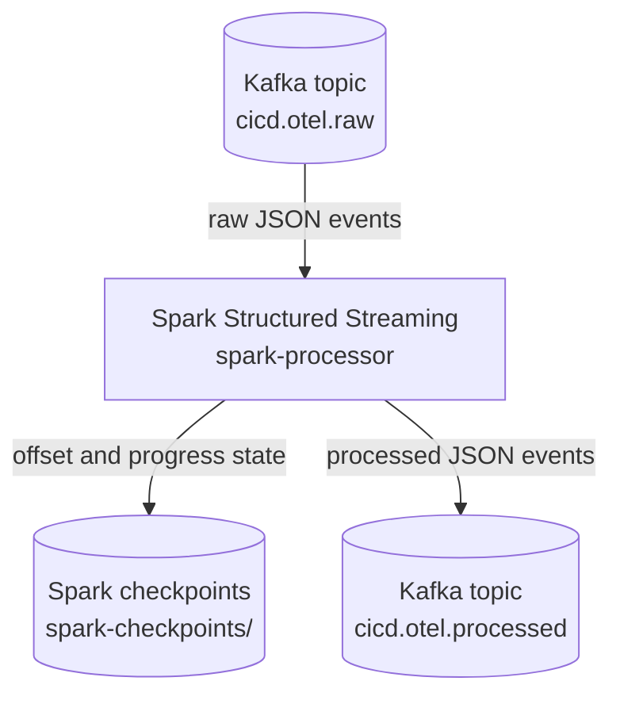

# Processing with Spark Structured Streaming

This step adds the processing stage immediately after Kafka. It reads raw CI/CD telemetry events from `cicd.otel.raw`, extracts useful Jenkins pipeline fields, and writes enriched events to `cicd.otel.processed`.



## What this stage uses

- Raw input topic: `cicd.otel.raw`
- Processed output topic: `cicd.otel.processed`
- Spark checkpoint path: `/tmp/spark-checkpoints/cicd-otel-processed`
- Component name added by Spark: `spark-structured-streaming`

The Spark job only consumes from the raw topic and writes to the processed topic.
It does not touch Jenkins, Logstash state files, or the OpenTelemetry output files.

Both Kafka topics are created by `kafka-init` before Logstash and Spark start using them.
This keeps the startup order predictable and avoids Spark subscribing to a topic that does not exist yet.

## What Spark writes

Each message written to Kafka uses `raw_event_sha256` as the key.
For a successful build-stage event, the value is a JSON object like this:

```json
{
  "processing_component": "spark-structured-streaming",
  "processed_at": "2026-05-11T00:00:00.000Z",
  "otel_signal": "logs",
  "event_dataset": "jenkins.build.console",
  "ingestion_component": "logstash",
  "source_topic": "cicd.otel.raw",
  "source_partition": 0,
  "source_offset": 42,
  "source_kafka_timestamp": "2026-05-11T00:00:00.000Z",
  "raw_event_sha256": "sha256-of-the-original-event",
  "ci_event": "build",
  "ci_stage": "build",
  "ci_status": "success",
  "is_failure": false,
  "risk_hint": 0.15,
  "service_name": "demo-service",
  "service_module": "demo-service-api",
  "dependency_cache": "hit",
  "job_name": "demo-ci-observability",
  "build_number": 42,
  "compile_time_ms": 4200,
  "raw_event": "{...original Logstash event...}"
}
```

Fields whose value is null are omitted from the JSON, to improve a message's readability. 

**Downstream Spark stages should read this topic with an explicit schema.**

The simulated Jenkins pipeline reports extra fields on the events where they
make sense. Spark extracts and forwards these optional features when present:

| Jenkins event | Optional processed fields |
| --- | --- |
| `checkout` | `source_branch` |
| `preflight` | `disk_free_pct`, `cpu_temp_c` |
| `build` | `service_module`, `build_tool`, `dependency_cache`, `compile_time_ms` |
| `test` | `test_suite`, `test_total`, `passed_tests`, `failing_tests`, `test_duration_ms`, `error_code` |
| `package` | `artifact_name`, `artifact_size_mb`, `artifact_checksum` |
| `deploy` | `target_environment`, `deployment_strategy`, `replicas_ready`, `replicas_expected`, `rollout_seconds` |
| `simulation` | `random_scenario`, `forced_success` |
| `pipeline_result`, `build_summary`, `build_report` | `pipeline_status`, `build_url`, OpenTelemetry span identifiers when available |

The original event is still kept in `raw_event`.
This is useful because the next stages can still access the full OpenTelemetry payload, while the extracted fields give MLlib, Elasticsearch and Kibana a cleaner base to work with.

The `risk_hint` field is not the final ML result. It is only a simple Spark-side signal: failed events get a high value, warnings get a medium value, and normal CI stage events get a low value. The real prediction/anomaly logic belongs to the later MLlib stage.

## Running it

```bash
docker compose up -d --build
```

The same flow can also be started with the helper commands in the Makefile.
On the first run Spark may take a bit longer because it has to download the Kafka connector package declared in `docker-compose.yml`.

## Checking the result

After Jenkins has generated some telemetry, the processed topic can be checked with:

```bash
docker compose exec kafka /opt/kafka/bin/kafka-console-consumer.sh \
  --bootstrap-server localhost:9092 \
  --topic cicd.otel.processed \
  --from-beginning
```

The same topic can also be inspected from Kafka UI at http://localhost:8085. (easier to access)

## Examples

The following are real examples of structured events that you can expect to see in the Kafka UI.

### Failed event due to CPU thermal throttling:

```json
{
	"processing_component": "spark-structured-streaming",
	"processed_at": "2026-05-19T12:40:53.297Z",
	"otel_signal": "logs",
	"event_dataset": "jenkins.build.console",
	"ingestion_component": "logstash",
	"source_topic": "cicd.otel.raw",
	"source_partition": 0,
	"source_offset": 57,
	"source_kafka_timestamp": "2026-05-19T12:40:52.832Z",
	"raw_event_sha256": "c0d7643348333f25d6576dc0263f3e54b97e2956b815a34c0144070a4d8b2a10",
	"ci_event": "preflight",
	"ci_stage": "preflight",
	"ci_status": "failed",
	"is_failure": true,
	"failure_category": "infrastructure",
	"failure_reason": "thermal_throttling",                       <---
	"failure_detail": "agent_cpu_temperature_above_safe_limit",   <---
	"risk_hint": 1.0,
	"service_name": "demo-service",
	"job_name": "demo-ci-observability",
	"build_number": 4,
	"raw_event": "{\"ingestion.component\":\"logstash\",\"@version\":\"1\",\"@timestamp\":\"2026-05-19T12:40:52.731330094Z\",\"message\":\"[2026-05-19T12:40:51.922Z] event=preflight stage=preflight status=failed service=demo-service job_name=demo-ci-observability build_number=4 reason=thermal_throttling detail=agent_cpu_temperature_above_safe_limit\",\"event.dataset\":\"jenkins.build.console\",\"host\":\"9e13401a41da\",\"ci.source\":\"jenkins-build-log\",\"otel.signal\":\"logs\",\"path\":\"/jenkins-home/jobs/demo-ci-observability/builds/4/log\"}"
}
```

### Pipeline 'build' stage completed (and how much time elapsed):

```json
{
	"processing_component": "spark-structured-streaming",
	"processed_at": "2026-05-19T12:40:56.273Z",
	"otel_signal": "logs",
	"event_dataset": "jenkins.build.console",
	"ingestion_component": "logstash",
	"source_topic": "cicd.otel.raw",
	"source_partition": 0,
	"source_offset": 71,
	"source_kafka_timestamp": "2026-05-19T12:40:55.862Z",
	"raw_event_sha256": "d96bd852431215c0b52b9b7e383bd949775c941c0ff2cb36aff10543cf5e255f",
	"ci_event": "build",
	"ci_stage": "build",      <---
	"ci_status": "success",   <---
	"is_failure": false,
	"risk_hint": 0.15,
	"service_name": "demo-service",
	"service_module": "demo-service-api",
	"dependency_cache": "hit",
	"job_name": "demo-ci-observability",
	"build_number": 3,
	"compile_time_ms": 6550,    <---
	"raw_event": "{\"ingestion.component\":\"logstash\",\"@version\":\"1\",\"@timestamp\":\"2026-05-19T12:40:55.762166945Z\",\"message\":\"[2026-05-19T12:40:55.280Z] event=build stage=build status=success service=demo-service job_name=demo-ci-observability build_number=3 module=demo-service-api compile_time_ms=6550 dependency_cache=hit\",\"event.dataset\":\"jenkins.build.console\",\"host\":\"9e13401a41da\",\"ci.source\":\"jenkins-build-log\",\"otel.signal\":\"logs\",\"path\":\"/jenkins-home/jobs/demo-ci-observability/builds/3/log\"}"
}
```
