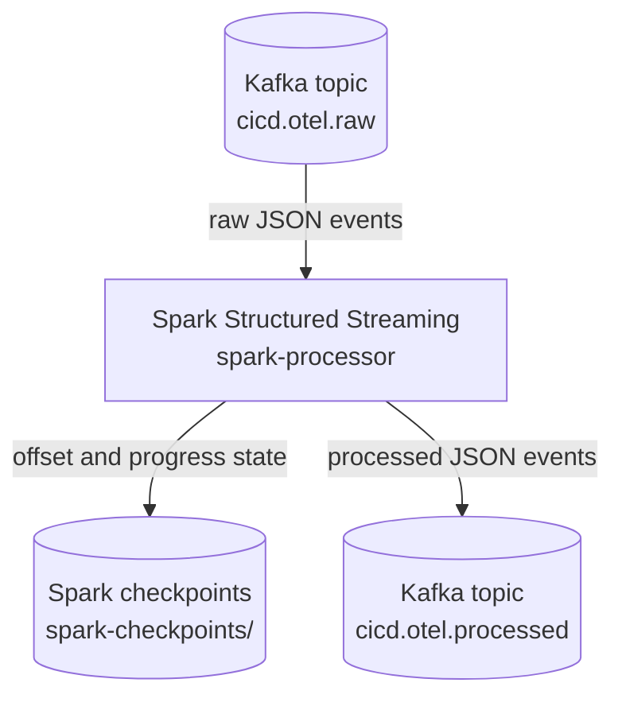

# Processing with Spark Structured Streaming

This step adds the processing stage immediately after Kafka. It reads raw CI/CD telemetry events from `cicd.otel.raw`, normalizes a small set of fields, and writes feed-forward events to `cicd.otel.processed`.



## What this stage uses

- Raw input topic: `cicd.otel.raw`
- Processed output topic: `cicd.otel.processed`
- Spark checkpoint path: `/tmp/spark-checkpoints/cicd-otel-processed`
- Component name added by Spark: `spark-structured-streaming`

The Spark job only consumes from the raw topic and writes to the processed topic.
It does not touch Jenkins, Logstash state files, or the OpenTelemetry output files.

Both Kafka topics are created by `kafka-init` before Logstash and Spark start using them.
This keeps the startup order predictable and avoids Spark subscribing to a topic that does not exist yet.

## What Spark writes

Each message written to Kafka uses `raw_event_sha256` as the key.
The value is a JSON object like this:

```json
{
  "processing_component": "spark-structured-streaming",
  "processed_at": "2026-05-11T00:00:00.000Z",
  "otel_signal": "traces",
  "event_dataset": "jenkins.otel.raw",
  "ingestion_component": "logstash",
  "source_topic": "cicd.otel.raw",
  "source_partition": 0,
  "source_offset": 42,
  "source_kafka_timestamp": "2026-05-11T00:00:00.000Z",
  "raw_event_sha256": "sha256-of-the-original-event",
  "raw_event": "{...original Logstash event...}"
}
```

The original event is still kept in `raw_event`.
This is useful because the next stages can still access the full OpenTelemetry payload, while the extra fields give us a cleaner base for MLlib and Elasticsearch later.

## Running it

```bash
docker compose up -d --build
```

The same flow can also be started with the helper commands in the Makefile.
On the first run Spark may take a bit longer because it has to download the Kafka connector package declared in `docker-compose.yml`.

## Checking the result

After Jenkins has generated some telemetry, the processed topic can be checked with:

```bash
docker compose exec kafka kafka-console-consumer.sh \
  --bootstrap-server localhost:9092 \
  --topic cicd.otel.processed \
  --from-beginning
```

The same topic can also be inspected from Kafka UI at http://localhost:8085. (easier to access)
