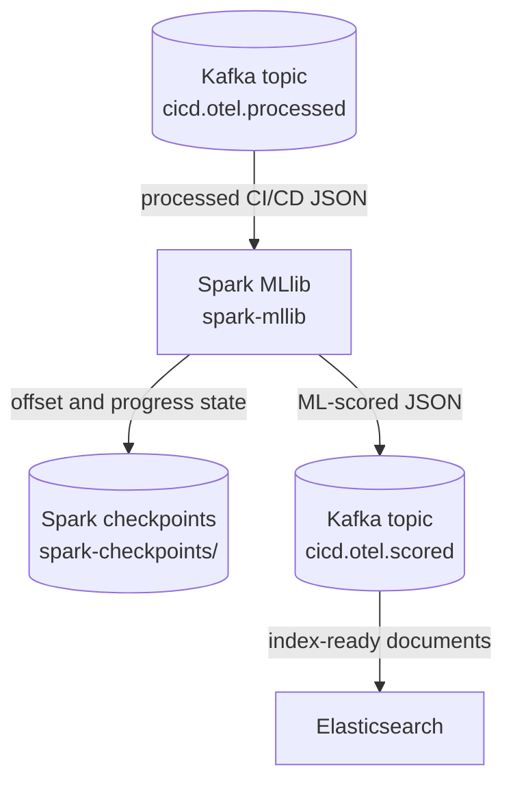

# Machine Learning with Spark MLlib

This step runs after the Spark Structured Streaming processor. It consumes the cleaned CI/CD events from `cicd.otel.processed`, applies a small Spark MLlib model, and writes scored observability events to `cicd.otel.scored`.



## What this stage uses

- Input topic: `cicd.otel.processed`
- Output topic: `cicd.otel.scored`
- Spark checkpoint path: `/tmp/spark-checkpoints/cicd-otel-scored`
- Component name added by this stage: `spark-mllib-risk-scoring`
- Model: `tap-ci-risk-logistic-regression`, trained with Spark MLlib at startup from 51 generated Jenkins build runs

The input is the explicit processed-event schema produced by the previous Spark stage. The MLlib component does not read Jenkins logs, OpenTelemetry files, or the raw Kafka topic directly.

## What the model does

This demo starts from scratch, so the model does not depend on stored historical data. At startup, Spark generates 50 baseline Jenkins builds in code (with values gathered from actual Jenkins runs in this project) and trains a logistic regression model from those rows.

The generated baseline follows the same stage behavior as the demo Jenkins job: each build moves through checkout, preflight, build, test, package, and deploy, and failed stages stop the build. The generated runs cover the same failure cases emitted by Jenkins:

- source checkout timeout
- agent disk or temperature problems
- dependency resolution failure
- flaky test failure
- artifact checksum mismatch
- staging rollout timeout
- pipeline-level success or failure

For each processed event, the job builds a compact feature vector from fields already extracted by Spark Structured Streaming:

- `risk_hint`
- failed/success status
- stage duration signals from compile, test, and rollout fields
- failing test ratio
- low disk and high CPU temperature signals
- deployment replica readiness gap
- HTTP error signal
- dependency cache miss signal
- stage, status, and failure category indexes

This keeps the ML layer simple but still related to CI/CD observability rather than being a generic demo classifier.

## What MLlib writes

Each scored Kafka message keeps the original processed fields and adds ML-specific fields for Elasticsearch and Kibana:

```json
{
  "processing_component": "spark-mllib-risk-scoring",
  "spark_processing_component": "spark-structured-streaming",
  "ml_scored_at": "2026-05-19T00:00:00.000Z",
  "ml_model_name": "tap-ci-risk-logistic-regression",
  "ml_model_version": "fakedatamodel_v1",
  "ml_model_type": "Spark MLlib LogisticRegression",
  "ml_risk_score": 0.93,
  "ml_risk_band": "critical",
  "ml_failure_prediction": true,
  "ml_anomaly_class": "known_infrastructure",
  "ml_model_probability": 0.93,
  "raw_event_sha256": "sha256-of-the-original-event",
  "ci_stage": "preflight",
  "ci_status": "failed",
  "failure_category": "infrastructure",
  "failure_reason": "thermal_throttling",
  "job_name": "demo-ci-observability",
  "build_number": 4
}
```

The topic is the handoff point for Elasticsearch. The indexer consumes `cicd.otel.scored` and indexes one document per scored CI/CD event.

## Running it

```bash
docker compose up -d --build
```

The MLlib service starts as `spark-mllib` and waits on Kafka, topic initialization, and the structured-streaming processor.

## Checking the result

After Jenkins has generated telemetry, the scored topic can be checked with:

```bash
docker compose exec kafka /opt/kafka/bin/kafka-console-consumer.sh \
  --bootstrap-server localhost:9092 \
  --topic cicd.otel.scored \
  --from-beginning
```

The same stream can also be inspected from Kafka UI at http://localhost:8085.
