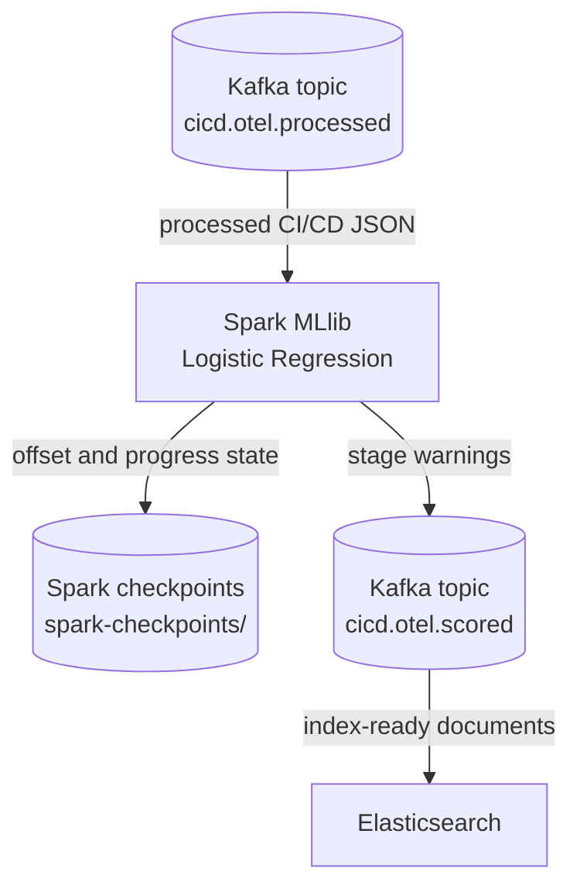

# Stage Failure Prediction with Spark MLlib

This step runs after Spark Structured Streaming. It consumes cleaned CI/CD
events from `cicd.otel.processed`, trains a small Spark MLlib Logistic
Regression model at startup, and writes warning-oriented events to
`cicd.otel.scored`.



## What This Stage Uses

- Input topic: `cicd.otel.processed`
- Output topic: `cicd.otel.scored`
- Spark checkpoint path: `/tmp/spark-checkpoints/cicd-otel-scored`
- Component name added by this stage: `spark-mllib-stage-failure-prediction`
- Model: `tap-ci-stage-failure-logistic-regression`

The MLlib component does not read Jenkins logs, OpenTelemetry files, or the raw
Kafka topic directly. It receives the normalized stage events produced by the
previous Spark step.

## Model Training

The model is trained as a normal supervised classifier:

- `X`: independent variables built from stage, signal domain, signal name,
  stage order, and normalized stage-pressure values.
- `y`: the dependent target variable, `label`, which means the stage is in a
  condition that should be treated as likely to fail soon.

The generated baseline is deterministic and large enough for a useful classroom
demo: 1,500 synthetic builds, with one sample per Jenkins stage. The samples are
based on the failure rules in `jenkins/jobs/seed.groovy`:

- checkout latency and retry count
- disk space and CPU temperature in pre-flight checks
- build duration and dependency-cache misses
- test duration and flaky-test pressure
- package artifact size
- deployment rollout duration and replica readiness

Training uses Spark's standard split:

```python
train_data, test_data = baseline.randomSplit([0.8, 0.2], seed=20260520)
```

The pipeline is fitted only on the 80% training split. The 20% test split is
used to log AUC, accuracy, precision, and recall in the `spark-mllib` logs.

The model does not use `is_failure`, `failure_reason`, `alert_candidate`,
`event_kind`, or dashboard fields as inputs. Those fields may still be used
after prediction to decide whether an event is an observed failure or a warning,
but they are not part of `X`.

## What MLlib Writes

The final output hides model internals from Kibana. It does not publish model
probability, numeric scoring fields, bucket labels, or feature vectors. Kibana gets fields a
human can read directly:

```json
{
  "processing_component": "spark-mllib-stage-failure-prediction",
  "ml_scored_at": "2026-05-20T00:00:00.000Z",
  "ml_model_name": "tap-ci-stage-failure-logistic-regression",
  "ml_model_version": "cicd-stage-failure-logreg-v1",
  "ml_stage_failure_warning": true,
  "predicted_failure_stage": "preflight",
  "warning_level": "warning",
  "warning_type": "predicted_stage_failure",
  "warning_title": "Stage may fail demo-ci-observability #42 preflight",
  "warning_message": "The model predicts a possible failure in preflight from cpu_temp_c value 84 action check_agent_disk_space_and_cpu_temperature",
  "warning_reason": "cpu_temp_c_near_limit",
  "recommended_action": "check_agent_disk_space_and_cpu_temperature",
  "dashboard_category": "stage_failure_warning",
  "job_name": "demo-ci-observability",
  "build_number": 42,
  "ci_stage": "preflight",
  "signal_domain": "agent_health",
  "signal_name": "cpu_temp_c",
  "signal_value": 84,
  "signal_unit": "celsius",
  "is_failure": false
}
```

Observed failures are still indexed, but they are not treated as predictions.
Use this distinction in dashboards:

```text
ml_stage_failure_warning: true and is_failure: false
```

means the model is warning before a failure. This:

```text
is_failure: true
```

means Jenkins already emitted a failed stage.

## Running It

```bash
docker compose up -d --build
```

The MLlib service starts as `spark-mllib` and waits on Kafka, topic
initialization, and the structured-streaming processor.

## Checking the Result

After Jenkins has generated telemetry, inspect the scored topic:

```bash
docker compose exec kafka /opt/kafka/bin/kafka-console-consumer.sh \
  --bootstrap-server localhost:9092 \
  --topic cicd.otel.scored \
  --from-beginning
```

The startup metrics are visible with:

```bash
make ml-logs
```
