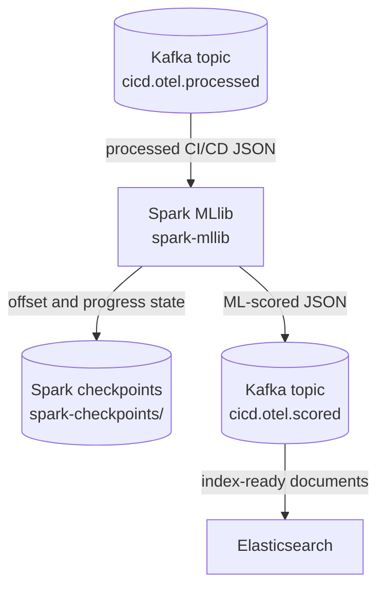

# Machine Learning with Spark MLlib

This step runs after the Spark Structured Streaming processor. It consumes the cleaned CI/CD events from `cicd.otel.processed`, applies a small Spark MLlib model, and writes scored observability events to `cicd.otel.scored`.



## What this stage uses

- Input topic: `cicd.otel.processed`
- Output topic: `cicd.otel.scored`
- Spark checkpoint path: `/tmp/spark-checkpoints/cicd-otel-scored`
- Component name added by this stage: `spark-mllib-risk-scoring`
- Model: `tap-ci-failure-risk-logistic-regression`, trained with Spark MLlib at startup from generated Jenkins build runs

The input is the explicit processed-event schema produced by the previous Spark stage. The MLlib component does not read Jenkins logs, OpenTelemetry files, or the raw Kafka topic directly.

## What the model does

This demo starts from scratch, so the model does not depend on stored historical data. At startup, Spark generates a small baseline in code and trains a logistic regression model from rows that match the cleaned Spark observability schema.

The model predicts whether a stage event belongs to a CI/CD risk pattern that
usually ends in a failure or near-miss. It is not trying to say that a failed
event has failed; known failures are already visible through `is_failure` and
`failure_reason`.

The generated baseline follows the same stage behavior as the demo Jenkins job: each build moves through checkout, preflight, build, test, package, and deploy, and failed stages stop the build. The generated runs cover the same failure cases emitted by Jenkins:

- source checkout timeout
- agent disk or temperature problems
- dependency resolution failure
- flaky test failure
- artifact checksum mismatch
- staging rollout timeout
- pipeline-level success or failure

For each processed event, the job builds a compact feature vector from fields already normalized by Spark Structured Streaming:

- current CI/CD stage
- signal domain and signal name
- stage order
- overall signal pressure
- source-control, agent-health, build, test, artifact, and deployment pressures

The model intentionally does not use `is_failure`, `alert_candidate`,
`risk_hint`, `severity_level`, `event_kind`, or `failure_category` as features.
Those fields are useful for dashboards, but using them as model inputs would
leak the answer into the prediction.

This keeps the ML layer simple but still related to CI/CD observability rather
than being a generic demo classifier.

The code is intentionally kept small:

- `job.py` only coordinates Kafka, parsing, scoring, and the output topic.
- `risk_model.py` owns the feature list, generated training rows, MLlib pipeline, risk bands, and dashboard fields.
- `schemas.py` defines the processed input schema and the compact scored output shape.

## What MLlib writes

Each scored Kafka message is intentionally small. It keeps only the fields that
Kibana needs for dashboards and alerts:

```json
{
  "processing_component": "spark-mllib-risk-scoring",
  "ml_scored_at": "2026-05-19T00:00:00.000Z",
  "ml_model_name": "tap-ci-failure-risk-logistic-regression",
  "ml_model_version": "cicd-risk-logreg-v4",
  "ml_risk_score": 0.93,
  "ml_risk_band": "critical",
  "ml_failure_prediction": true,
  "ml_predictive_alert": false,
  "ml_alert_type": "known_infrastructure",
  "ml_alert_reason": "thermal_throttling",
  "ml_recommended_action": "check_agent_disk_space_and_cpu_temperature",
  "ml_anomaly_class": "known_infrastructure",
  "ml_prediction_target": "failure_risk_from_stage_pressure",
  "ml_score_basis": "model_probability_no_status_leakage",
  "dashboard_category": "failure_event",
  "notification_level": "critical",
  "notification_title": "CI/CD failure demo-ci-observability #4 preflight",
  "notification_message": "Risk critical for agent_health cpu_temp_c because thermal_throttling action check_agent_disk_space_and_cpu_temperature",
  "ml_model_probability": 0.93,
  "ml_feature_overall_pressure": 1.0,
  "raw_event_sha256": "sha256-of-the-original-event",
  "observed_at": "2026-05-19T00:00:00.000Z",
  "job_name": "demo-ci-observability",
  "build_number": 4,
  "ci_stage": "preflight",
  "stage_order": 2,
  "ci_status": "failed",
  "event_kind": "failure",
  "signal_domain": "agent_health",
  "signal_name": "cpu_temp_c",
  "signal_value": 96,
  "signal_unit": "celsius",
  "severity_level": "critical",
  "failure_category": "infrastructure",
  "failure_reason": "thermal_throttling"
}
```

The topic is the handoff point for Elasticsearch. The indexer consumes `cicd.otel.scored` and indexes one document per scored CI/CD event.

## Running it

```bash
docker compose up -d --build
```

The MLlib service starts as `spark-mllib` and waits on Kafka, topic initialization, and the structured-streaming processor.

## Checking the result

After Jenkins has generated telemetry, the scored topic can be checked with:

```bash
docker compose exec kafka /opt/kafka/bin/kafka-console-consumer.sh \
  --bootstrap-server localhost:9092 \
  --topic cicd.otel.scored \
  --from-beginning
```

The same stream can also be inspected from Kafka UI at http://localhost:8085.
