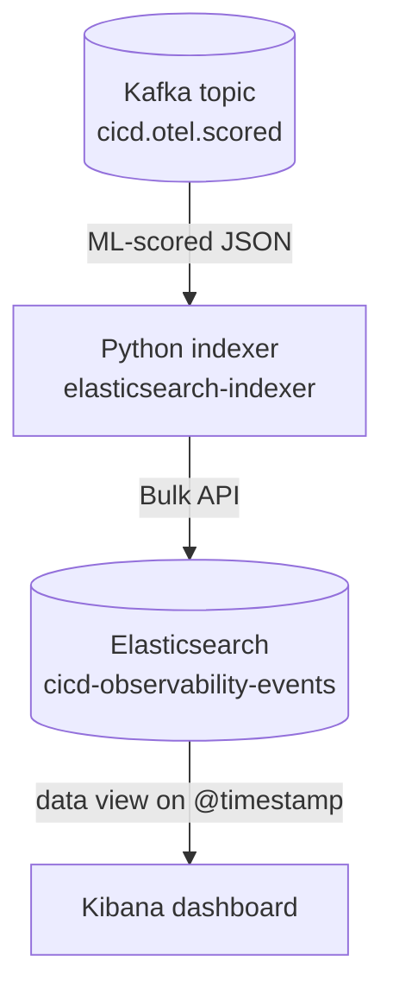

# Indexing with Elasticsearch

This step runs after the Spark MLlib scorer. It consumes ML-scored CI/CD events from Kafka and indexes them into Elasticsearch so Kibana can build the live CI/CD dashboard.



## What this stage uses

- Input topic: `cicd.otel.scored`
- Elasticsearch REST API: http://localhost:9200
- Elasticsearch user: `elastic`
- Demo password: `admine` unless `ELASTICSEARCH_PASSWORD` is set
- Index name: `cicd-observability-events`
- Kibana time field for the dashboard: `@timestamp`

The password is intentionally simple for the local demo. For a real deployment it should be set through a private `.env` file or secret manager.

## What the indexer does

The Python component in `elastic_indexer/` uses:

- `KafkaConsumer` to read scored events from `cicd.otel.scored`
- `Elasticsearch` from the official `elasticsearch` Python library
- `elasticsearch.helpers.bulk` to index documents in batches

Each document keeps only the compact scored observability fields plus a few
indexing fields:

- `@timestamp` for Kibana time filtering
- `indexed_at` for when Elasticsearch received the event
- `indexer_source_topic`, `indexer_source_partition`, and `indexer_source_offset`
- a deterministic document id based on `raw_event_sha256` when available

The indexer drops unexpected fields before indexing, and the index template uses
`dynamic: false` so old noisy fields do not become dashboard fields by accident.
The mapped fields are meant for Kibana terms charts, time series, and alerts:

- exact fields such as `job_name`, `ci_stage`, `signal_domain`, `signal_name`,
  `severity_level`, `ml_risk_band`, `ml_anomaly_class`, `ml_alert_type`,
  `ml_prediction_target`, `ml_score_basis`, `dashboard_category`, and
  `notification_level`
- numeric fields such as `ml_risk_score`, `ml_model_probability`,
  `ml_feature_overall_pressure`, and `signal_value`
- boolean fields such as `is_failure`, `alert_candidate`,
  `ml_failure_prediction`, and `ml_predictive_alert`
- readable text fields such as `event_summary`, `notification_title`, and
  `notification_message`
- timestamps such as `@timestamp`, `observed_at`, `ml_scored_at`, and
  `indexed_at`

## Running it

```bash
docker compose up -d --build
```

Elasticsearch is exposed on http://localhost:9200 and the indexer starts as `elasticsearch-indexer`.
Kibana is exposed on http://localhost:5601. Dashboards are created manually in
the Kibana UI from the `cicd-observability-events` data view.

Check the Elasticsearch containers with:

```bash
make es-logs
```

## Checking the indexed data

The helper query script uses filters for exact matches, bounded result sizes, and aggregations for live summaries.

```bash
make es-summary
```

To query Elasticsearch directly:

```bash
curl -u elastic:admine http://localhost:9200/cicd-observability-events/_count
```
