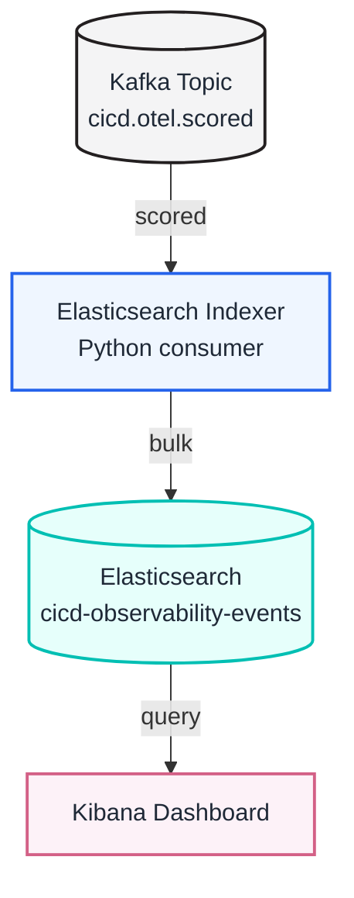

# Indexing with Elasticsearch

This step runs after the Spark MLlib predictor. It consumes warning-oriented
CI/CD events from Kafka and indexes them into Elasticsearch so Kibana can build
the live dashboard.



## What this stage uses

- Input topic: `cicd.otel.scored`
- Elasticsearch REST API: http://localhost:9200
- Elasticsearch user: `elastic`
- Demo password: `admine` unless `ELASTICSEARCH_PASSWORD` is set
- Index name: `cicd-observability-events`
- Kibana time field for the dashboard: `@timestamp`

The password is intentionally simple for the local demo. For a real deployment it should be set through a private `.env` file or secret manager.

## What the indexer does

The Python component in `elastic_indexer/` uses:

- `KafkaConsumer` to read scored events from `cicd.otel.scored`
- `Elasticsearch` from the official Python client
- `elasticsearch.helpers.bulk` to index documents in batches

Each document keeps only the fields needed by Kibana:

- warning fields: `ml_stage_failure_warning`, `warning_level`,
  `warning_type`, `warning_title`, `warning_message`, `warning_reason`,
  `recommended_action`
- CI/CD fields: `job_name`, `build_number`, `ci_stage`, `ci_status`,
  `pipeline_status`, `signal_domain`, `signal_name`, `signal_value`,
  `failure_reason`
- index fields: `@timestamp`, `indexed_at`, `indexer_source_topic`,
  `indexer_source_partition`, and `indexer_source_offset`

The index template uses `dynamic: false` so noisy or internal model fields do
not become dashboard fields by accident.

## Running It

```bash
docker compose up -d --build
```

Elasticsearch is exposed on http://localhost:9200 and the indexer starts as
`elasticsearch-indexer`. Kibana is exposed on http://localhost:5601.

Check the Elasticsearch containers with:

```bash
make es-logs
```

## Checking the Indexed Data

The helper query script returns a compact warning summary:

```bash
make es-summary
```

To list warning and failure documents directly:

```bash
make es-warnings
```

To query Elasticsearch directly:

```bash
curl -u elastic:admine http://localhost:9200/cicd-observability-events/_count
```

If old model-score fields are still visible in Kibana, delete the local demo
index or run `make clean` before rebuilding. Kibana can remember old field
metadata until the data view is refreshed.
